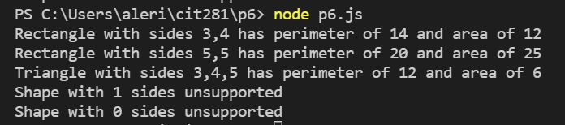

## Techniques Used 

- Exporting modules
- Non-web server Node.js JavaScript code
    - Lambda expressions
    - Ternary operators
    - Classes
    - Class inheritance
    - constructor() method
    - .reduce() method
    - Math.sqrt() method
    - .toString() method
    - Switch operators
    - template literals
    - console.log() method

## Objectives

### Create a file which holds a "shape" base class and a rectangle and triangle class which inherit from it. These classes will contain formulas to calculate the perimeter and area of a shape. 
```
class Shape {
    constructor(sides = []){
        this.sides = sides;
    }
    perimeter = () => this.sides.length > 0 ? this.sides.reduce((add, current) => add + current) : 0; 
}

console.log(new Shape([5, 10]).perimeter());  // 15
console.log(new Shape([1, 2, 3, 4, 5]).perimeter()); // 15
console.log(new Shape().perimeter()); // 0

class Rectangle extends Shape {
    constructor (length = 0, width = 0){
        super([length, width, length, width]);
        this.length = length;
        this.width = width;
    }
    area = () => this.width * this.length;
}

console.log(new Rectangle(4, 4).perimeter());  // 16
console.log(new Rectangle(4, 4).area());  // 16
console.log(new Rectangle(5, 5).perimeter()); // 20
console.log(new Rectangle(5, 5).area()); // 25
console.log(new Rectangle().perimeter()); // 0
console.log(new Rectangle().area()); // 0

class Triangle extends Shape {
    constructor(sideA = 0, sideB = 0, sideC = 0){
        super([sideA, sideB, sideC])
        this.sideA = sideA;
        this.sideB = sideB;
        this.sideC = sideC;
    }
    area = () => {
        const s = ((this.sideA + this.sideB + this.sideC)/ 2);
        return Math.sqrt( s *(s-this.sideA)*(s-this.sideB)*(s-this.sideC))
    }
}
```
### Write a block of code which handles arrays of a shape's side lengths. Call on the correct corresponding class to calculate the perimeter and area of given data. 

```
const data = [ [3, 4], [5, 5], [3, 4, 5], [10], [] ];
for(const shape of data) {
switch (shape.length) {
   case 2:
       let rectP = new Rectangle(...shape).perimeter();
       let rectA = new Rectangle(...shape).area();

       console.log(`Rectangle with sides ${shape.toString()} has perimeter of ${rectP} and area of ${rectA}`)
       break;
    case 3:
        let triP = new Triangle(...shape).perimeter();
        let triA = new Triangle(...shape).area();
 
        console.log(`Triangle with sides ${shape.toString()} has perimeter of ${triP} and area of ${triA}`)
        break;
    default:
        console.log(`Shape with ${shape.length} sides unsupported`)

}
}
```

Result example:


